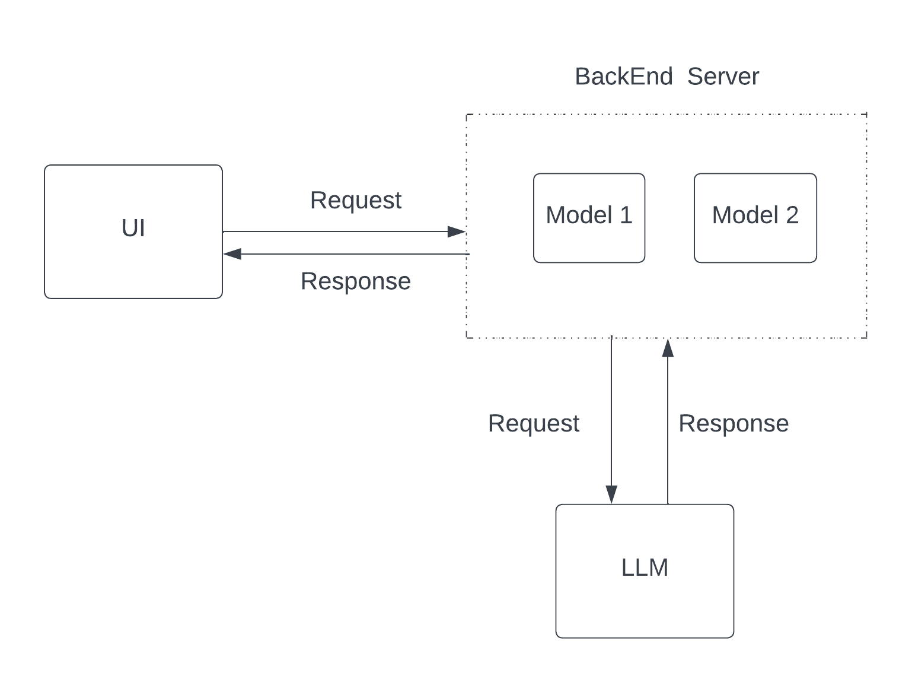
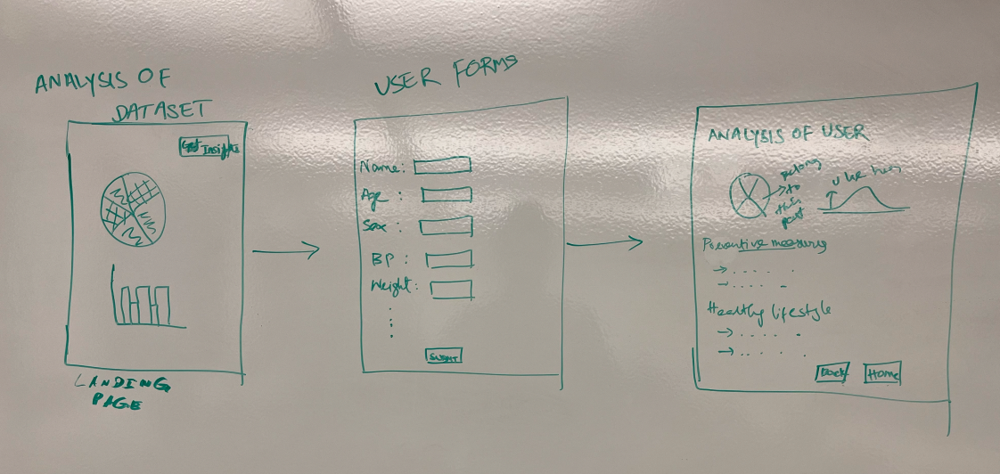
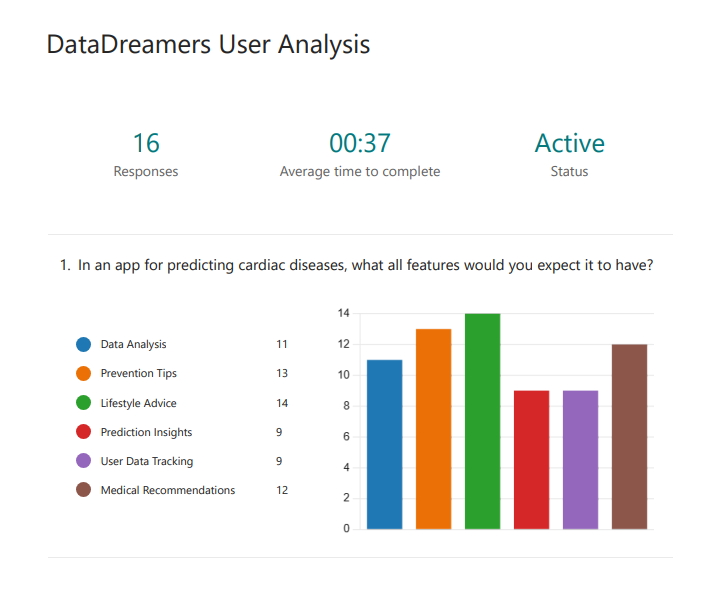

# Heart Stroke Prediction Project

## Overview

The Heart Stroke Prediction project focuses on creating a machine learning model to predict the likelihood of heart strokes based on various health parameters. This model is designed to assist healthcare professionals in early diagnosis and prevention, potentially saving lives through timely intervention.

## Low-Fi Prototype

The low-fidelity prototype is designed to demonstrate the architecture and the flow of the Heart Stroke Prediction application. Below is the architecture diagram along with some sample application screens.

## Architecture Diagram

## Application Screens

## User Survey

A user survey was conducted to gather feedback on the prototype and the overall user experience. The insights gained from the survey will be used to refine the model and the application interface.

- [User Survey Form](https://forms.office.com/r/RrWVjSF3w6)

## Conclusion

The Heart Stroke Prediction project is a step towards leveraging data science and machine learning for improving healthcare outcomes. By predicting the risk of heart strokes early, this tool aims to assist medical professionals in making informed decisions, ultimately enhancing patient care.

